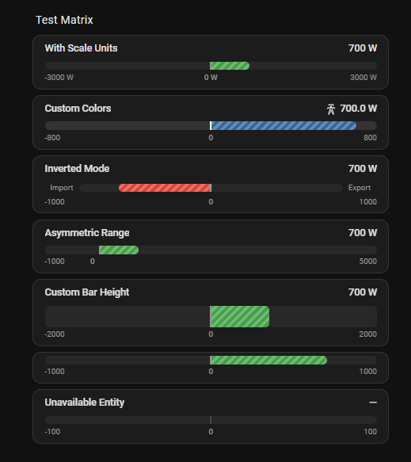

# Horizontal Bidirectional Gauge

A custom Lovelace card for [Home Assistant](https://www.home-assistant.io/) that renders a horizontal bar gauge with a zero divider line, ideal for sensors with bidirectional values such as energy import/export, temperature differentials, or any measurement that swings positive and negative.



## Features

- Bidirectional fill from a configurable zero divider line
- Independent colors for negative (left) and positive (right) fills
- Asymmetric range support (e.g. -200 to +5000)
- Animated diagonal stripe flow indicator showing direction
- Inverted mode to flip direction mapping
- Configurable labels, icons, precision, and bar height
- Scale row with optional unit display
- Visual editor with expandable sections (no YAML required)
- Full theme integration via CSS custom properties
- Handles unavailable / unknown entity states gracefully
- Shows actual sensor value in header even when bar is capped at max

## Requirements

- Home Assistant 2024.1 or later
- HACS (Home Assistant Community Store) — optional, for easy installation

## Installation

### Method 1: HACS (Recommended)

1. Open HACS in your Home Assistant instance.
2. Go to **Integrations** → click the **⋮** menu (top right) → **Custom repositories**.
3. Add this repository URL and select **Dashboard** as the category.
4. Search for **Horizontal Bidirectional Gauge** and install it.
5. Restart Home Assistant or clear your browser cache.
6. Add the card to your dashboard.

### Method 2: Manual Copy

1. Download `horizontal-bidirectional-gauge.js` from the [latest release](https://github.com/abpei/hacs_horizontal-bidirectional-gauge/releases/latest).
2. Copy the file into your `config/www/` directory.
3. Add the following to your `configuration.yaml` (if not already present):

   ```yaml
   lovelace:
     resources:
       - url: /local/horizontal-bidirectional-gauge.js
         type: module
   ```

4. Restart Home Assistant or reload your resources.

## Configuration

Configure via the **visual editor** (add card → select Horizontal Bidirectional Gauge) or via YAML.

### Config Schema

| Option | Type | Default | Description |
|---|---|---|---|
| `entity` | string | **(required)** | Entity ID of the sensor. |
| `min` | number | `-max` | Minimum gauge value (left edge). |
| `max` | number | `100` | Maximum gauge value (right edge). |
| `negative_color` | string | `var(--error-color)` | Color for the left (negative) fill. |
| `positive_color` | string | `var(--success-color)` | Color for the right (positive) fill. |
| `zero_divider_color` | string | `var(--secondary-text-color)` | Color of the zero divider line. |
| `background_color` | string | `var(--secondary-background-color)` | Background color of the bar track. |
| `title` | string | entity name | Card title. Set to `""` to hide entirely. |
| `name` | string | `""` | Name override. Falls back to entity friendly name. |
| `negative_label` | string | `""` | Label on the left side (e.g. "Export"). |
| `positive_label` | string | `""` | Label on the right side (e.g. "Import"). |
| `unit` | string | entity unit | Unit override. Falls back to entity `unit_of_measurement`. |
| `precision` | number | auto | Decimal places. Auto: 0 for ranges ≥1000, 1 otherwise. |
| `bar_height` | number | `12` | Bar height in pixels. |
| `show_zero_divider` | boolean | `true` | Show the zero divider line. |
| `show_value` | boolean | `true` | Show the numeric value in the title row. |
| `show_icon` | boolean | `false` | Show entity icon next to the value. |
| `icon` | string | entity icon | Icon override (e.g. `mdi:transmission-tower`). |
| `show_scale_units` | boolean | `false` | Show unit of measurement on scale labels. |
| `inverted` | boolean | `false` | Flip direction mapping (left = positive, right = negative). |
| `animation` | boolean | `true` | Diagonal stripe flow animation on the fill. |

### YAML Examples

#### Basic — Energy Import/Export

```yaml
type: custom:horizontal-bidirectional-gauge
entity: sensor.grid_power
title: "Grid Power"
max: 5000
negative_label: "Export"
positive_label: "Import"
```

#### With Scale Units

```yaml
type: custom:horizontal-bidirectional-gauge
entity: sensor.grid_power
max: 5000
show_scale_units: true
negative_label: "Export"
positive_label: "Import"
```

#### Asymmetric Range

```yaml
type: custom:horizontal-bidirectional-gauge
entity: sensor.grid_power
min: -200
max: 5000
show_scale_units: true
negative_label: "Export"
positive_label: "Import"
```

#### Advanced — Custom Colors and Icon

```yaml
type: custom:horizontal-bidirectional-gauge
entity: sensor.indoor_outdoor_temp_diff
title: "Temperature Differential"
min: -15
max: 15
negative_color: "#42a5f5"
positive_color: "#ef5350"
zero_divider_color: "#9e9e9e"
background_color: "#263238"
show_icon: true
icon: "mdi:thermometer-lines"
bar_height: 16
precision: 1
```

#### Compact Widget — No Title

```yaml
type: custom:horizontal-bidirectional-gauge
entity: sensor.power_flow
title: ""
show_zero_divider: false
bar_height: 8
negative_color: "var(--warning-color)"
positive_color: "var(--info-color)"
```

## Entity Requirements

The card expects a numeric sensor entity. The entity's `state` value is parsed as a float. Non-numeric or unavailable states render as an em-dash (`—`) with dimmed fills.

The header always displays the actual sensor value, even if it exceeds the configured `max` or is below the configured `min`. Only the bar fill is clamped to the range.

## Theming

Colors accept any valid CSS value, including Home Assistant theme variables:

```yaml
negative_color: "var(--error-color)"
positive_color: "var(--success-color)"
background_color: "var(--card-background-color)"
```

## License

MIT
